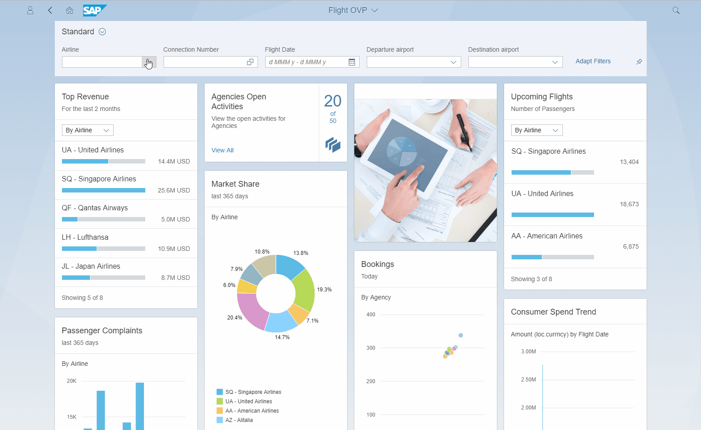
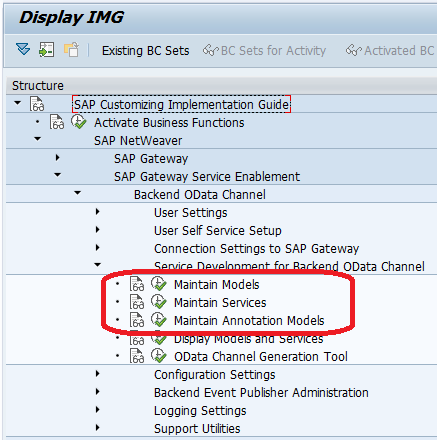
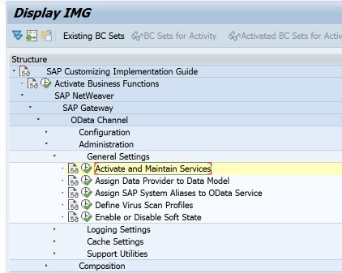
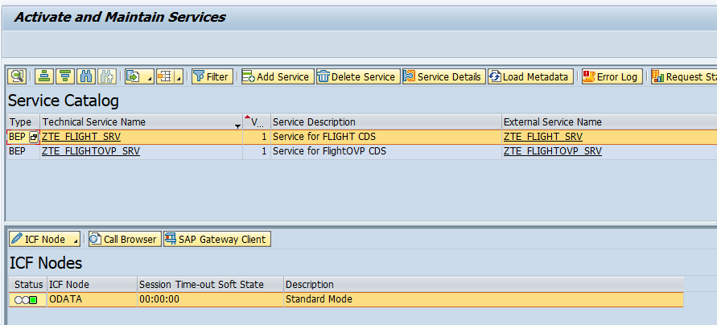

:airplane: #  Show me the code

To install the code onto your ABAP system you will need to use the [abapGit](https://github.com/larshp/abapGit) project by [@larshp](https://github.com/larshp).

Steps to Install
=========

* [Import CDS Objects with abapGit](#import-cds-objects-with-abapgit)
* [Create OData services and models](#create-odata-services-and-models)
* [Activate Services](#activate-services)
* [Import SAPUI5 Applications](#import-sapui5-applications)

Import CDS Objects with abapGit
=========

Result

Create OData services and models
=========

Once all objects are activated you will need to maintain the MPC, DPC and Annotation locations. The below screenshot shows where to find this in the IMG.

2 services 

Create Model

Create the corresponding Service and Assign the above Model to Service

Create the Annotation Model 

And assign the Annotation Model to the service

repeat the steps above for the OVP Service

Create Model

Create the corresponding Service and Assign the above Model to Service

Create the Annotation Model 

And assign the Annotation Model to the service

Activate Services
=========

Select the "Add Selected Services" button, locate the 2 Services and press "Add Selected Services"

Should see Service Creation successul

Confirm by finding Services in list of Active services

Import SAPUI5 applications
=========

download and extract the two SAPUI5 [ZFLIGHTLIST](https://github.com/jasper07/Teched17/blob/master/ZFLIGHTLIST.zip?raw=true) application zip file

call report /UI5/UI5_REPOSITORY_LOAD and upload from temporary folder

Confirm and Upload

repeat for [ZFLIGHTOVP](https://github.com/jasper07/Teched17/blob/master/ZFLIGHTOVP.zip?raw=true)

locate and run the ZFLIGHOVP app

[http://server:port/sap/bc/ui5_ui5/sap/zflightovp/webapp/index.html?sap-client=001#Shell-home](http://vhcalnplci:8000/sap/bc/ui5_ui5/sap/zflightovp/webapp/index.html?sap-client=001#Shell-home)

## Enjoy 